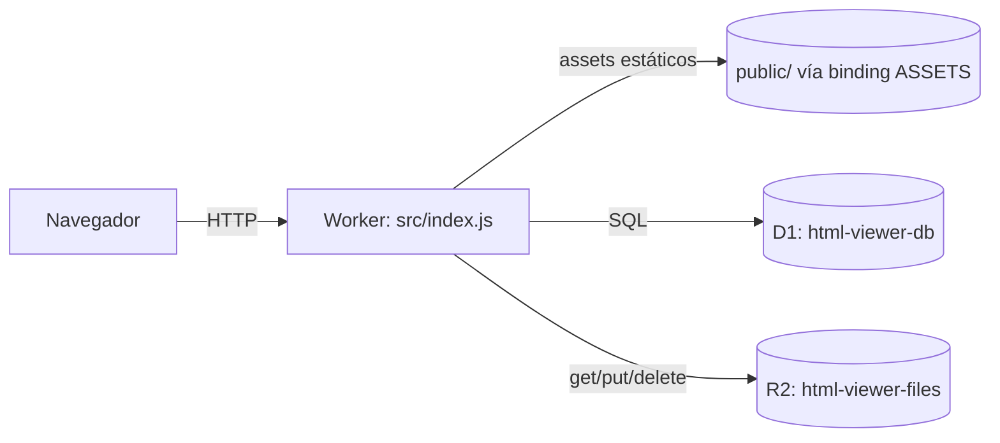

# DOCS.md — Mapeo técnico de html-viewer

Documentación de referencia del codebase: arquitectura, ruteo, backend función por función, modelo de datos, seguridad y una sección detallada de **cómo está construido el UI**. Refleja el estado actual del repo.

> Para instalación y despliegue, ver [README.md](README.md). Este documento es el "mapa absoluto" del código.

---

## 1. Visión general

`html-viewer` es una app de una sola pieza (un Worker de Cloudflare) que permite, con un **token único** de acceso:

1. Elegir/crear un **perfil** (nombre, correo, área) al iniciar sesión.
2. Subir archivos `.html` a una **biblioteca**, marcándolos **públicos o privados**.
3. Verlos renderizados, **editar su texto** (estilo Gmail) o su **código** (con resaltado), y **presentarlos** a pantalla completa.
4. Generar un **link por archivo** para compartir: público (abierto a cualquiera) o privado (exige sesión).

El valor: cualquiera puede ver un reporte HTML por un link, sin saber qué es un HTML ni cómo abrirlo.

---

## 2. Arquitectura

Un único Worker sirve **todo**: el frontend estático (`public/`), la API JSON y el contenido HTML aislado. Los datos viven en **D1** (metadatos) y **R2** (contenido).



**Principio de diseño:** el frontend es estático (HTML/CSS/JS vanilla, sin build). Las páginas no se renderizan en el servidor; cargan datos vía `fetch` a la API. El Worker solo corre lógica en rutas dinámicas (ver §7).

---

## 3. Stack tecnológico

| Capa | Tecnología | Por qué |
|---|---|---|
| Cómputo | Cloudflare Workers | Serverless, $0 inicial, sirve assets + API en un solo deploy |
| Metadatos | D1 (SQLite) | Relacional, incluido en Workers, ideal para perfiles/documentos |
| Contenido | R2 (object storage) | HTML puede pesar MB; D1 tiene límite de 1 MB/fila. R2 sin costo de egress |
| Frontend | HTML + CSS + JS vanilla (módulos ES) | Sin framework ni build step |
| CLI/deploy | Wrangler 4.x | `wrangler dev` (local con D1/R2 emulados) y `wrangler deploy` |

Sin paso de compilación: Wrangler empaqueta `src/index.js` directamente. El frontend no usa CDNs: **Poppins** y **CodeMirror 5** se sirven self-host desde `public/fonts/` y `public/vendor/`.

---

## 4. Mapa de archivos

```
wrangler.jsonc            Config del Worker: assets, D1, R2, run_worker_first
package.json              Scripts (dev, deploy, db:migrate:*) y devDep wrangler
.dev.vars(.example)       Secretos locales: AUTH_TOKEN, SESSION_SECRET (.dev.vars git-ignored)
migrations/
  0001_init.sql           Esquema base: profiles, documents + índices
  0002_profiles_public.sql  profiles +email/area; documents +public; índices
src/
  index.js                Router: API + contenido + sirve assets + failsafe de storage
  auth.js                 Sesión por cookie firmada (HMAC) + verificación de token
  util.js                 Helpers: respuestas JSON, ids, base64url
public/
  index.html / login.js     Login en 2 pasos (token → perfil)
  library.html / library.js Biblioteca: tabs, subida, cards con thumbnail, switcher de perfil
  viewer.html / viewer.js   Visor/editor (Vista / Texto / Código) + Presentar + Compartir
  shared.html / shared.js   Vista pública compartida (+ Presentar; bloquea privados)
  app.css                   Estilos + design tokens (tema claro/oscuro)
  common.js                 Helpers + perfil activo + modales (crear perfil, compartir) + modo presentación
  theme.js                  Selector de tema (Sistema/Claro/Oscuro)
  fonts/poppins-*.woff2     Tipografía Poppins self-host (subset latin)
  logo-*.png · icon.png     Logos oficiales de Reuse (swap por tema) + favicon
  vendor/codemirror/        CodeMirror 5 self-host (core + modos)
```

---

## 5. Modelo de datos (D1)

### Tabla `profiles`
| Columna | Tipo | Notas |
|---|---|---|
| `id` | INTEGER PK AUTOINCREMENT | |
| `name` | TEXT NOT NULL | Nombre del perfil |
| `email` | TEXT | Correo (opcional) — migración 0002 |
| `area` | TEXT | Área (opcional) — migración 0002 |
| `created_at` | TEXT | Default `datetime('now')` |

### Tabla `documents`
| Columna | Tipo | Notas |
|---|---|---|
| `id` | TEXT PK | UUID |
| `share_id` | TEXT UNIQUE NOT NULL | Token URL-safe para el link |
| `title` | TEXT NOT NULL | |
| `profile_id` | INTEGER | FK → `profiles(id)` `ON DELETE SET NULL` (enforce en código) |
| `r2_key` | TEXT NOT NULL | Key del contenido en R2 (`docs/<id>.html`) |
| `size` | INTEGER | Bytes del HTML |
| `public` | INTEGER NOT NULL DEFAULT 0 | 0=privado, 1=público — migración 0002 |
| `created_at` / `updated_at` | TEXT | Default `datetime('now')` |

**Índices:** `idx_documents_created`, `idx_documents_share`, `idx_documents_public`, `idx_documents_profile`.
**Regla:** el contenido HTML nunca va en D1 (límite 1 MB/fila); siempre en R2.

---

## 6. Almacenamiento (R2) y failsafe

- Bucket `html-viewer-files`, binding `BUCKET`. Una key por documento: `docs/<uuid>.html`.
- El contenido se guarda **tal cual** (sin sanitizar); el aislamiento ocurre al servirlo (§10).
- **Failsafe:** `STORAGE_LIMIT = 7 GiB`. El uso total se calcula con `SUM(size)` en D1. Si una subida o un crecimiento superaría el umbral, se responde **507** y la biblioteca muestra un banner; **eliminar siempre se permite** (para liberar espacio). Evita exceder el plan gratuito de R2 (10 GB).

---

## 7. Ruteo

`assets.run_worker_first = ["/api/*", "/auth/*", "/raw/*", "/doc/*", "/s/*"]`. El resto sirve assets directo.

| # | Patrón | Auth | Acción |
|---|---|---|---|
| 1 | `/raw/:shareId` | público si el doc es público; si no, **requiere sesión** | contenido HTML aislado (R2); `?download` fuerza descarga |
| 2 | `/api/shared/:shareId` | público (privado → 403 sin sesión) | metadatos `{title, updated_at, public}` |
| 3 | `/s/:shareId` | público | sirve `shared.html` |
| 4 | `POST /auth/login` | público | valida token → cookie |
| 5 | `POST /auth/logout` | público | borra cookie (204) |
| 6 | `/api/session` | — | 200 si hay sesión, 401 si no |
| 7 | `/doc/:id` | shell público | sirve `viewer.html` (datos requieren sesión) |
| 8 | `/api/*` | **requiere sesión** | `handleApi` (storage, perfiles, documentos) |
| 9 | (otra) | — | `env.ASSETS.fetch` |

Las páginas con segmento dinámico (`/doc/:id`, `/s/:shareId`) las sirve el Worker reusando el shell estático (`serveAsset`).

---

## 8. Backend (`src/`) — función por función

### `src/util.js`
`json`, `notFound`/`badRequest`/`unauthorized`, `newId` (uuid), `newShareId` (12 bytes → base64url), `base64url`.

### `src/auth.js`
Sesión **sin estado**: cookie `hv_session` firmada con HMAC-SHA256 (no se guarda en DB). `createSessionCookie` (payload `v1.<exp>` + firma; `HttpOnly; SameSite=Lax; Max-Age=30d`; `Secure` solo si HTTPS), `clearSessionCookie`, `isAuthed` (recomputa firma + valida expiración, tiempo constante), `verifyToken`.

### `src/index.js`
Constantes: `MAX_UPLOAD = 10 MB`, `STORAGE_LIMIT = 7 GiB`, `SANDBOX_CSP`.

- `fetch` → router (orden de §7), try/catch → 500.
- `serveAsset` → sirve un shell estático vía `env.ASSETS`.
- `handleLogin` → valida token → cookie.
- `handleRaw(request, env, url)` → busca por `share_id`; **si el doc es privado y no hay sesión → 403**; si no, devuelve el HTML con `Content-Security-Policy: sandbox …`, `nosniff`, `no-store` (y `Content-Disposition` con `?download`).
- `handleSharedMeta(request, env, path)` → `{title, updated_at, share_id, public}`; privado sin sesión → 403 `{private:true}`.
- `getUsedBytes` / `handleStorage` → `GET /api/storage` devuelve `{used, limit, percent, near, over}`.
- `storageBlocked(used)` → respuesta 507 con mensaje.
- `handleApi` → enruta:
  - `/api/storage` (GET).
  - `/api/profiles`: GET (`id,name,email,area`), POST (`{name,email,area}`); `DELETE /api/profiles/:id` (batch: null en docs + borrar perfil).
  - `/api/documents`: GET con filtros `?scope=public` (públicos) o `?profile_id=N` (de un perfil); POST → `uploadDocument`.
  - `/api/documents/:id`: GET (con `content`), PUT, DELETE.
- `uploadDocument` → `multipart/form-data` (`file`, `title?`, `profile_id?`, `public`), valida ≤10 MB y el failsafe de storage, guarda en R2 e inserta.
- `getDocument` → fila (`SELECT d.*`, incluye `public`) + `profile_name` + `content` de R2.
- `updateDocument` → update parcial: `content` (reescribe R2 + chequeo de crecimiento vs failsafe), `title`, `profile_id`, `public`; siempre `updated_at`.
- `deleteDocument` → borra R2 + fila.

Todas las consultas usan **prepared statements con `bind`** (sin inyección SQL).

---

## 9. Autenticación, sesión y perfil

- Un solo `AUTH_TOKEN` (secreto) → cookie firmada de 30 días. El token gatea toda la API.
- El **perfil activo** NO es seguridad: es una preferencia por navegador (`localStorage` `hv-profile`). Se elige al iniciar sesión y filtra la vista "Mis archivos". Como hay un único token, todo el contenido es accesible para esa sesión; el perfil es atribución/vista.
- En el cliente, `common.js → api()` redirige a `/` ante un 401 (excepto en `/` y `/s/...`).

---

## 10. Modelo de seguridad (aislamiento del HTML)

El HTML subido es contenido potencialmente activo. **No se sanitiza**; se **aísla al renderizar**. Contextos:

| Contexto | `sandbox` | Origen | Scripts |
|---|---|---|---|
| Vista pública (`/raw`), Vista del visor, thumbnails, modo presentación | `allow-scripts` (sin `allow-same-origin`) + `/raw` manda `CSP: sandbox` | Opaco | Corren, aislados |
| Editar texto (`#editFrame`) | `allow-same-origin` (**sin** `allow-scripts`) | Mismo origen | **Inertes** pero presentes en el DOM (se conservan al guardar) |

**Visibilidad:** un doc **privado** solo se sirve por `/raw` y `/api/shared` con sesión válida (403 si no). Un doc **público** es abierto a cualquiera con el link.

> Endurecimiento futuro: servir `/raw` desde un subdominio aparte para aislar también las cookies.

---

## 11. Cómo está construido el UI

### 11.1 Filosofía
- **Estático + JS vanilla con módulos ES.** Cada página importa helpers de `/common.js` e incluye `/theme.js`. Sin framework ni bundler; la única librería de terceros es **CodeMirror 5** (vendored, carga diferida solo en el editor de código).
- **Una hoja de estilos** (`app.css`) con design tokens claro/oscuro.

### 11.2 Assets y temas
Rutas **absolutas** (`/app.css`, etc.) para funcionar bajo URLs con segmento dinámico. Favicon `/icon.png` (isotipo). Cada `<head>` corre un **script inline anti-flash** que fija `data-theme` antes del primer pintado. `theme.js` gestiona el selector (Sistema/Claro/Oscuro, persistido en `localStorage`).

### 11.3 Tokens (`app.css`)
Claro en `:root`, oscuro en `:root[data-theme="dark"]` (oscuro = Foundation Purple `#151930`; primario Solid Purple `#37417f` en claro, Re-Blue `#4b75f7` en oscuro; lila, verde de acento). También define los colores de sintaxis de CodeMirror (`--cm-*`) por tema. Tipografía **Poppins**.

### 11.4 Helpers (`common.js`)
- `api`, `fmtDate`, `fmtSize`, `escapeHtml`, `toast`.
- Perfil activo: `getProfile` / `setProfile` / `clearProfile` (`localStorage`).
- `openModal(build)` — overlay + diálogo (cierra con click fuera / Esc).
- `createProfileModal(onCreated)` — modal con nombre/correo/área → `POST /api/profiles`.
- `shareModal(doc)` — modal estilo Drive: link, copiar, y **toggle público/privado** (`PUT … {public}`); emite `hv:doc-changed`.
- `presentMode({srcdoc|src})` — **modo presentación** (ver §11.6).

### 11.5 Páginas
- **`index.html` + `login.js`** — Login en **2 pasos**: (1) token → `POST /auth/login`; (2) dropdown de perfiles + "Crear perfil" (modal). Al elegir, guarda el perfil en `localStorage` y va a `/library`. Si ya hay sesión y perfil, salta directo.
- **`library.html` + `library.js`** — Topbar con logo, selector de tema y **menú de perfil** (avatar + nombre; switch de perfil / crear / salir). Sección de subida (archivo, título, **visibilidad pública/privada**) con el banner del failsafe. **Tabs**: *Mis archivos* (`?profile_id=`) y *Público* (`?scope=public`). Cada doc es una **card** con **thumbnail** (iframe a `/raw` escalado, lazy con `IntersectionObserver`), badges (perfil, Público/Privado) y **acciones solo-ícono** (compartir → `shareModal`, descargar, eliminar). El título/thumbnail abren `/doc/:id`.
- **`viewer.html` + `viewer.js`** — Topbar: volver, título editable, **3 pestañas**, selector de tema, **Presentar**, **Compartir** (`shareModal`), Guardar. Superficies en **hoja delimitada** (`.stage`): Vista (`#viewFrame`, interactiva), Editar texto (`#editFrame`, `designMode`, con anillo + hint), Código (`#codePane` con CodeMirror, carga diferida). `content` es la fuente de verdad (se sincroniza desde la superficie visible). Guarda con `PUT`; `beforeunload` avisa cambios sin guardar.
- **`shared.html` + `shared.js`** — Vista pública: logo (enlaza a `/`), título, tema, **Presentar**, Descargar. Consulta `/api/shared/:shareId`; si es **privado** (403) muestra "Documento privado"; si existe, carga el iframe a `/raw` en una hoja delimitada.

### 11.6 Modo presentación (`presentMode`)
Overlay a pantalla completa (usa la **Fullscreen API**; si falla, queda como overlay fijo) con barra de controles: **zoom −/+**, indicador %, **Ajustar** (reset) y **Salir**. Atajos: `+`/`-` zoom, `0` ajustar, `Esc` salir. El zoom es real (`transform: scale`) con un wrap dimensionado para permitir scroll/pan al acercar. Se invoca desde el visor (con `srcdoc` del contenido actual) y desde la página compartida (con `src=/raw/:shareId`).

### 11.7 Patrón datos → DOM
Listas con template strings + `escapeHtml` vía `innerHTML`; handlers por **delegación**. Tras una mutación se vuelve a llamar la función de carga.

---

## 12. Referencia de API

| Método | Ruta | Auth | Descripción |
|---|---|---|---|
| POST | `/auth/login` | — | `{token}` → cookie |
| POST | `/auth/logout` | — | Cierra sesión |
| GET | `/api/session` | cookie | Verifica sesión |
| GET | `/api/storage` | sí | `{used, limit, percent, near, over}` |
| GET / POST | `/api/profiles` | sí | Lista (`id,name,email,area`) / crea (`{name,email,area}`) |
| DELETE | `/api/profiles/:id` | sí | Elimina perfil |
| GET | `/api/documents?scope=public` | sí | Documentos públicos |
| GET | `/api/documents?profile_id=N` | sí | Documentos de un perfil |
| POST | `/api/documents` | sí | multipart `file,title?,profile_id?,public` |
| GET / PUT / DELETE | `/api/documents/:id` | sí | Lee (con `content`) / actualiza (`content?,title?,profile_id?,public?`) / elimina |
| GET | `/api/shared/:shareId` | — (privado: 403) | Metadatos públicos |
| GET | `/raw/:shareId` | público o sesión si privado | Contenido aislado (`?download`) |
| GET | `/s/:shareId` · `/doc/:id` | — / shell | Páginas (datos según auth) |

---

## 13. Configuración
- `wrangler.jsonc`: `assets` (directory `./public`, `run_worker_first`), `d1_databases` (binding `DB`, `database_id`), `r2_buckets` (binding `BUCKET`), `observability`.
- Secretos: `AUTH_TOKEN`, `SESSION_SECRET`. Local en `.dev.vars`; producción con `wrangler secret put`.

## 14. Desarrollo y despliegue
```bash
npm install
cp .dev.vars.example .dev.vars      # define AUTH_TOKEN y SESSION_SECRET
npm run db:migrate:local
npm run dev                         # http://localhost:8787
```
Despliegue: `wrangler d1 create`, `wrangler r2 bucket create`, `npm run db:migrate:remote`, `wrangler secret put …`, `npm run deploy`. Detalle en [README.md](README.md).

## 15. Limitaciones conocidas
- Sin versionado/historial de ediciones (el guardado sobrescribe).
- Sin búsqueda ni carpetas en la biblioteca.
- `/raw` se sirve desde el mismo origin (idealmente, subdominio aparte).
- Perfil = atribución/vista por navegador, no cuenta (un solo token de acceso global).
- Editor de texto = `designMode` (básico); el de código sí tiene resaltado.
- Thumbnails = iframes en vivo escalados (no pre-renderizados); con bibliotecas muy grandes conviene pre-render server-side.
