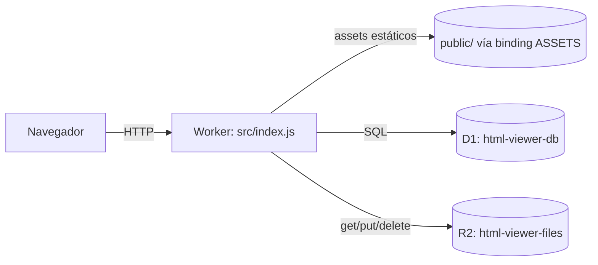
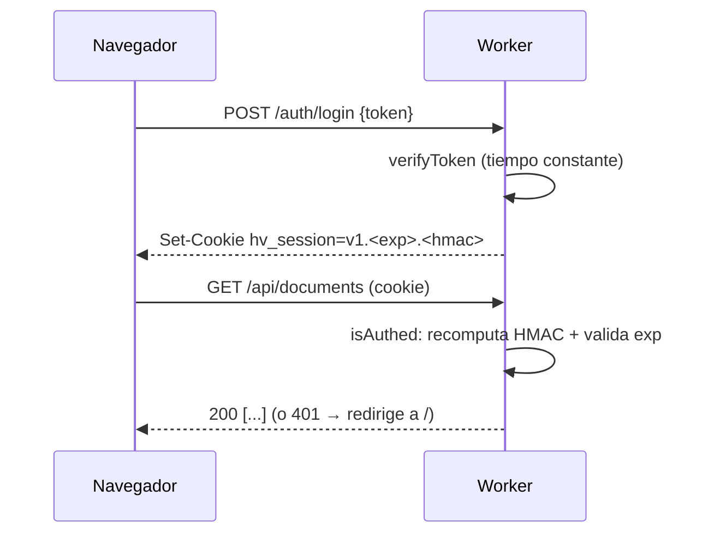

# DOCS.md — Mapeo técnico de html-viewer

Documentación de referencia del codebase: arquitectura, ruteo, backend función por función, modelo de datos, seguridad, y una sección detallada de **cómo está construido el UI**. Refleja el estado actual del repo.

> Para instalación y despliegue, ver [README.md](README.md). Este documento es el "mapa absoluto" del código.

---

## 1. Visión general

`html-viewer` es una app de una sola pieza (un Worker de Cloudflare) que permite a un usuario autenticado con un **token único**:

1. Subir archivos `.html` a una biblioteca personal.
2. Verlos renderizados, editar su **texto** (estilo Gmail) o su **código** fuente.
3. Generar un **link público por archivo** para compartir (solo lectura, sin token).

El valor: cualquiera puede ver un reporte HTML por un link, sin saber qué es un HTML ni cómo abrirlo.

---

## 2. Arquitectura

Un único Worker sirve **todo**: el frontend estático (carpeta `public/`), la API JSON y el contenido HTML aislado. Los datos viven en **D1** (metadatos) y **R2** (contenido).



**Principio de diseño:** el frontend es estático (HTML/CSS/JS vanilla, sin build). Las páginas no se renderizan en el servidor; cargan datos vía `fetch` a la API. El Worker solo corre lógica en rutas dinámicas (ver §7).

---

## 3. Stack tecnológico

| Capa | Tecnología | Por qué |
|---|---|---|
| Cómputo | Cloudflare Workers | Serverless, $0 inicial, sirve assets + API en un solo deploy |
| Metadatos | D1 (SQLite) | Relacional, incluido en Workers, ideal para perfiles/documentos |
| Contenido | R2 (object storage) | HTML puede pesar MB; D1 tiene límite de 1 MB/fila. R2 sin costo de egress |
| Frontend | HTML + CSS + JS vanilla (módulos ES) | Sin framework ni build step; máxima simplicidad de mantención |
| CLI/deploy | Wrangler 4.x | `wrangler dev` (local con D1/R2 emulados) y `wrangler deploy` |

No hay paso de compilación: Wrangler empaqueta `src/index.js` (y sus imports) directamente. El frontend tampoco depende de CDNs: **Poppins** y **CodeMirror 5** se sirven self-host desde `public/fonts/` y `public/vendor/`.

---

## 4. Mapa de archivos

```
wrangler.jsonc            Config del Worker: assets, D1, R2, run_worker_first
package.json              Scripts (dev, deploy, db:migrate:*) y devDep wrangler
.dev.vars(.example)       Secretos locales: AUTH_TOKEN, SESSION_SECRET (.dev.vars es git-ignored)
.gitignore               node_modules, .wrangler, .dev.vars, etc.
.claude/launch.json      Config del preview tool (npm run dev en :8787)
migrations/
  0001_init.sql          Esquema D1: tablas profiles y documents + índices
src/
  index.js               Punto de entrada: router + handlers de API/contenido
  auth.js                Sesión por cookie firmada (HMAC) + verificación de token
  util.js                Helpers: respuestas JSON, ids, base64url
public/
  index.html             Página de login (token)
  login.js               Lógica de login + redirección si ya hay sesión
  library.html           Biblioteca (subir, perfiles, lista de archivos)
  library.js             Lógica de biblioteca
  viewer.html            Visor/editor del dueño (3 pestañas)
  viewer.js              Lógica del editor (Vista / Texto / Código)
  shared.html            Vista pública compartida (solo lectura)
  shared.js              Lógica de la vista compartida
  app.css                Estilos + design tokens (tema claro/oscuro)
  common.js              Helpers compartidos (api, fmtDate, fmtSize, escapeHtml, toast)
  theme.js               Selector de tema (Sistema/Claro/Oscuro) con ícono + dropdown
  fonts/poppins-*.woff2  Tipografía Poppins self-host (subset latin)
  logo-purple.png · logo-white.png · icon.png   Logos oficiales de Reuse (swap por tema) + favicon
  vendor/codemirror/     CodeMirror 5 self-host (core + modos) para el editor de código
```

---

## 5. Modelo de datos (D1)

Definido en `migrations/0001_init.sql`.

### Tabla `profiles`
| Columna | Tipo | Notas |
|---|---|---|
| `id` | INTEGER PK AUTOINCREMENT | |
| `name` | TEXT NOT NULL | Nombre del perfil (etiqueta de "quién subió") |
| `created_at` | TEXT | Default `datetime('now')` (UTC, ISO-ish) |

### Tabla `documents`
| Columna | Tipo | Notas |
|---|---|---|
| `id` | TEXT PK | UUID (`crypto.randomUUID()`) |
| `share_id` | TEXT UNIQUE NOT NULL | Token aleatorio URL-safe para el link público |
| `title` | TEXT NOT NULL | Título mostrado |
| `profile_id` | INTEGER | FK → `profiles(id)` `ON DELETE SET NULL` (enforcement en código, ver §8) |
| `r2_key` | TEXT NOT NULL | Key del contenido en R2 (`docs/<id>.html`) |
| `size` | INTEGER | Bytes del HTML |
| `created_at` / `updated_at` | TEXT | Default `datetime('now')` |

**Índices:** `idx_documents_created (created_at DESC)`, `idx_documents_share (share_id)`.

**Regla:** el contenido HTML NUNCA va en D1 (límite de 1 MB/fila); siempre en R2.

---

## 6. Almacenamiento (R2)

- Bucket `html-viewer-files`, binding `BUCKET`.
- Una key por documento: `docs/<uuid>.html`, con `httpMetadata.contentType = text/html; charset=utf-8`.
- El contenido se guarda **tal cual** (sin sanitizar). El aislamiento ocurre al servirlo (§8/§10).

---

## 7. Ruteo

`wrangler.jsonc` declara `assets.run_worker_first` con los prefijos dinámicos; el resto de las URLs sirven el archivo estático directamente sin invocar el Worker.

```
run_worker_first: ["/api/*", "/auth/*", "/raw/*", "/doc/*", "/s/*"]
```

Orden de evaluación en `src/index.js → fetch()`:

| # | Patrón | Auth | Acción |
|---|---|---|---|
| 1 | `/raw/:shareId` | público | `handleRaw` — contenido HTML aislado (R2) |
| 2 | `/api/shared/:shareId` | público | `handleSharedMeta` — título/fecha |
| 3 | `/s/:shareId` | público | sirve `shared.html` (shell) |
| 4 | `POST /auth/login` | público | `handleLogin` → cookie |
| 5 | `POST /auth/logout` | público | borra cookie (204) |
| 6 | `/api/session` | — | 200 si hay sesión, 401 si no |
| 7 | `/doc/:id` | shell público | sirve `viewer.html` (los datos sí requieren auth) |
| 8 | `/api/*` | **requiere sesión** | `handleApi` (perfiles, documentos) |
| 9 | (cualquier otra) | — | `env.ASSETS.fetch` (archivos estáticos) |

Las páginas con URL "bonita" y segmento dinámico (`/doc/:id`, `/s/:shareId`) las sirve el Worker reusando el shell estático (`serveAsset`), porque no existe un archivo físico por id. Las demás (`/`, `/library`) las resuelve el binding de assets por nombre.

> **Nota de seguridad de rutas:** el shell de `/doc/:id` es público (HTML estático sin datos sensibles). Los datos del documento se sirven solo por la API protegida; si no hay sesión, `viewer.js` recibe 401 y redirige a `/`.

---

## 8. Backend (`src/`) — función por función

### `src/util.js`
- `json(data, init)` → `Response` con `content-type: application/json`.
- `notFound() / badRequest() / unauthorized()` → respuestas 404 / 400 / 401.
- `newId()` → `crypto.randomUUID()`.
- `newShareId()` → 12 bytes aleatorios (`crypto.getRandomValues`) → base64url (~16 chars).
- `base64url(buf)` → codifica `ArrayBuffer`/`Uint8Array` a base64 URL-safe.

### `src/auth.js`
Sesión **sin estado**: una cookie firmada con HMAC-SHA256; no se guarda nada en DB. Como hay un único token, todas las sesiones son equivalentes.
- `sign(secret, data)` → HMAC-SHA256 (Web Crypto) en base64url.
- `timingSafeEqual(a, b)` → comparación de tiempo constante (anti-timing-attack).
- `createSessionCookie(env, secure)` → payload `v1.<exp>` + firma; cookie `hv_session` con `HttpOnly; Path=/; SameSite=Lax; Max-Age=30d` y `Secure` **solo si HTTPS** (clave para que funcione en `http://localhost`).
- `clearSessionCookie(secure)` → cookie expirada (Max-Age=0).
- `isAuthed(request, env)` → parsea la cookie, recomputa la firma, compara en tiempo constante y valida expiración.
- `verifyToken(env, token)` → compara el token recibido con `AUTH_TOKEN` (tiempo constante).

### `src/index.js`
Constantes: `MAX_UPLOAD = 10 MB`, `SANDBOX_CSP = "sandbox allow-scripts allow-forms allow-popups allow-modals allow-downloads"`.

- `fetch(request, env, ctx)` → router (orden de §7), envuelto en try/catch → 500.
- `serveAsset(env, request, assetPath)` → reescribe el pathname y limpia el query para servir un shell estático vía `env.ASSETS`.
- `handleLogin(request, env, secure)` → valida token → setea cookie de sesión.
- `handleRaw(env, url)` → busca el doc por `share_id`, lee el objeto de R2 y lo devuelve con headers: `Content-Type`, `Content-Security-Policy: sandbox …`, `X-Content-Type-Options: nosniff`, `Cache-Control: no-store`; con `?download` agrega `Content-Disposition: attachment`.
- `handleSharedMeta(env, path)` → `{title, updated_at, share_id}` por `share_id` (público).
- `handleApi(request, env, path)` → enruta a perfiles/documentos:
  - `GET/POST /api/profiles`, `DELETE /api/profiles/:id` (al borrar perfil, un `batch` pone `profile_id = NULL` en sus documentos y luego elimina el perfil → enforcement de la FK en código).
  - `GET/POST /api/documents`, `GET/PUT/DELETE /api/documents/:id`.
- `uploadDocument(request, env)` → lee `multipart/form-data` (`file`, `title?`, `profile_id?`), valida ≤10 MB, genera `id` + `share_id`, guarda el HTML en R2 (`docs/<id>.html`) e inserta la fila.
- `getDocument(env, id)` → fila de D1 (con `profile_name` por LEFT JOIN) + `content` leído de R2.
- `updateDocument(request, env, id)` → update parcial: si viene `content` lo reescribe en R2 y actualiza `size`; opcionalmente `title` y `profile_id`; siempre `updated_at`.
- `deleteDocument(env, id)` → borra el objeto de R2 y la fila de D1.

Todas las consultas usan **prepared statements con `bind`** (sin interpolación → sin inyección SQL).

---

## 9. Autenticación y sesión



- Un solo `AUTH_TOKEN` (secreto). La cookie es `HttpOnly` (no accesible por JS), firmada (no falsificable sin `SESSION_SECRET`) y con expiración a 30 días.
- En el cliente, `common.js → api()` redirige a `/` ante un 401 (excepto en `/` y en páginas públicas `/s/...`).

---

## 10. Modelo de seguridad (aislamiento del HTML)

El HTML subido es contenido potencialmente activo (puede traer `<script>`). **No se sanitiza** (para preservar el reporte intacto, con su interactividad); en su lugar se **aísla al renderizar**. Hay tres contextos, cada uno con su sandbox:

| Contexto | Dónde | `sandbox` | Origen | Scripts del reporte |
|---|---|---|---|---|
| **Vista pública** (`/raw`) | `shared.html` iframe + header CSP | `allow-scripts` (sin `allow-same-origin`) + `CSP: sandbox …` | Opaco | Corren, aislados |
| **Vista** (dueño) | `viewer.html#viewFrame` | `allow-scripts` (sin `allow-same-origin`) | Opaco | Corren, aislados |
| **Editar texto** (dueño) | `viewer.html#editFrame` | `allow-same-origin` (**sin** `allow-scripts`) | Mismo origen | **Inertes** (no se ejecutan) pero presentes en el DOM |

**El truco del modo "Editar texto":** se usa `allow-same-origin` (para que la página padre pueda leer/escribir el `contentDocument` y activar `designMode`) pero **sin** `allow-scripts`, así los `<script>` del reporte no se ejecutan (no pueden abusar de la cookie de sesión) pero **siguen presentes en el DOM**, por lo que se conservan intactos al serializar y guardar. La ruta `/raw` además manda `Content-Security-Policy: sandbox`, que fuerza origen opaco incluso si alguien la abre directo (top-level).

> Endurecimiento futuro: servir `/raw` desde un subdominio aparte para aislar también las cookies del origin principal.

---

## 11. Cómo está construido el UI

### 11.1 Filosofía

- **Estático + JS vanilla con módulos ES.** Cada página es un `.html` con un `<script type="module">` que importa helpers de `/common.js` e incluye `/theme.js` (selector de tema). No hay framework ni bundler; la única librería de terceros es **CodeMirror 5** (vendored en `public/vendor/`, con carga diferida solo en el editor de código). Cada página carga sus datos por `fetch`.
- **Una hoja de estilos** (`app.css`) compartida por todas las páginas.
- **Sin plantillas en servidor.** El HTML de cada página es un "shell" fijo; el contenido dinámico se inyecta en el cliente vía `innerHTML`/asignaciones puntuales.

### 11.2 Assets y cómo se sirven

Las páginas referencian assets con rutas **absolutas** (`/app.css`, `/common.js`, etc.) para que funcionen también cuando el Worker sirve un shell bajo una URL con segmento dinámico (`/doc/:id`, `/s/:shareId`). El favicon es `/icon.png` (isotipo de Reuse). Cada `<head>` ejecuta además un **script inline anti-flash** que fija `data-theme` (claro/oscuro) antes del primer pintado, leyendo la preferencia de `localStorage` o `prefers-color-scheme`.

### 11.3 Sistema de estilos (`app.css`)

Dos temas vía design tokens (identidad de Reuse): claro en `:root`, oscuro en `:root[data-theme="dark"]`. El tema lo gestiona `theme.js` (default **Sistema**; persiste en `localStorage`; bootstrap anti-flash inline en cada `<head>`). Tipografía **Poppins** (self-host en `public/fonts/`).

| Token | Claro | Oscuro | Uso |
|---|---|---|---|
| `--bg` | `#f6f7fb` | `#151930` (Foundation Purple) | Fondo de página |
| `--surface` | `#ffffff` | `#1e2342` | Tarjetas / paneles / hoja del doc |
| `--ink` | `#151930` | `#ffffff` | Texto principal |
| `--muted` | `#535a78` | `#aeb7e6` | Texto secundario |
| `--line` | `#e2e5f2` | lila α | Bordes |
| `--primary` | `#37417f` (Solid Purple) | `#4b75f7` (Re-Blue) | Acción primaria |
| `--ring` | `#4b75f7` | `#afb9ff` | Foco |
| `--accent` | `#c6ffad` (verde, uso puntual) | idem | Highlight |

También define los colores de sintaxis de CodeMirror (`--cm-*`) por tema. 

**Clases/componentes:**
- Layout: `.center` (login), `.container` (columna máx. 960px), `.topbar`, `.spacer`.
- Marca: `.brand-link` + `.brandmark` (logo; se intercambia claro/oscuro por CSS según `data-theme`).
- Superficies: `.card`, `.auth` (card de login), `.doc-card` (tarjeta de archivo).
- Botones: sólido `--primary` por defecto; variantes `.ghost` (borde), `.link` (texto), `.danger`.
- Formularios: `input/select/textarea` con foco `outline` en `--ring`; `.upload-form`, `.row`, `.profiles` (`<details>`).
- Biblioteca: `.docs` (grid `auto-fill minmax(260px,1fr)`), `.doc-title`, `.doc-meta`, `.badge` (perfil; `.badge.green` usa el verde de acento), `.doc-actions`.
- Visor: `.viewer-body` (flex column, 100vh), `.viewer-main`; superficies `.stage` (hoja del doc: iframe centrado con borde/sombra) y `.pane` (editor de código), `.edit-hint` (pill de modo edición), `.title-input`, `.tabs` (segmented control).
- Selector de tema: `.theme-menu` / `.theme-btn` (ícono) / `.theme-pop` (dropdown); `.theme-corner` lo posiciona en el login.
- Editor de código: estilos de CodeMirror (`.CodeMirror*`, tokens `.cm-*`) sobreescritos con los tokens del tema.
- Feedback: `#toast`.
- Responsive: `@media (max-width:560px)` reordena la topbar y centra las tabs.

### 11.4 Helpers compartidos (`common.js`)

- `api(path, opts)` — wrapper de `fetch`: serializa `body` objeto a JSON, y ante **401** redirige a `/` (salvo en `/` y `/s/...`).
- `fmtDate(s)` — formatea fechas SQLite (UTC) a `es-CL`.
- `fmtSize(n)` — bytes → `B/KB/MB`.
- `escapeHtml(s)` — escapa texto antes de interpolarlo en `innerHTML` (anti-XSS en la propia UI).
- `toast(msg)` — crea/reutiliza `#toast` y lo muestra ~2.2s.

### 11.5 Páginas

**`index.html` + `login.js`** — Card centrada con input de token. Al cargar, `GET /api/session`; si hay sesión, redirige a `/library`. Al enviar, `POST /auth/login`; si OK redirige, si no muestra error.

**`library.html` + `library.js`** — Topbar con logo (link a `/library`), selector de tema y *Salir*. Debajo, tres bloques:
1. *Subir HTML*: `<input type=file>` + título + `<select>` de perfil + botón. Envía `FormData` a `POST /api/documents`.
2. *Gestionar perfiles* (`<details>`): agregar/eliminar; `loadProfiles()` puebla el `<select>` y la lista.
3. *Mis archivos*: `loadDocs()` pinta `.doc-card`s con título (link a `/doc/:id`), badge de perfil, tamaño, fecha y acciones (Abrir, Copiar link, Descargar, Eliminar). Delegación de eventos en el contenedor para copiar (`navigator.clipboard`) y borrar.

**`viewer.html` + `viewer.js`** — El editor, lo más rico del UI. La topbar tiene: volver, **título editable**, las **3 pestañas**, el selector de tema, Copiar link y Guardar. El área principal contiene tres superficies superpuestas (una visible a la vez); cada una muestra el documento como una **hoja delimitada** (`.stage` → iframe centrado con `max-width`, borde y sombra sobre el fondo de la app):
- `#viewFrame` (sandbox `allow-scripts`) — **Vista** interactiva.
- `#editFrame` (sandbox `allow-same-origin`) — **Editar texto** (`designMode`), con anillo de acento + hint flotante (`#editHint`) que señalan el modo edición.
- `#codePane` con **CodeMirror 5** (self-host, carga diferida) — **Código** con números de línea y resaltado (htmlmixed).

Diseño de estado (post-fix de un bug de guardado):
- `content` es la **única fuente de verdad** del HTML, y se actualiza **en cada input** (tanto en designMode como en el textarea).
- `visibleSurface()` deriva la superficie activa **del DOM** (flags `.hidden`), no de una variable de estado — esto evita que un guardado tome contenido viejo si el estado se desincroniza (causa del bug original).
- `setTab(tab)` sincroniza `content` desde la superficie actual, alterna visibilidad/clases y carga el contenido en la nueva superficie. En "texto" usa `editFrame.onload` para activar `designMode` y enganchar el listener de input.
- `readEditFrame()` serializa `doctype + documentElement.outerHTML` del iframe de edición (los `<script>` inertes se conservan), con **guarda anti-vacío**: si el iframe aún no cargó, devuelve el `content` actual (evita que al volver a Vista quede en blanco).
- El editor de **Código** usa CodeMirror; `cm.setValue()` programático se marca con `cmSettingValue` para no contar como edición (no activa "Guardar" por solo abrir la pestaña).
- Guardar: `PUT /api/documents/:id {content, title}`; `beforeunload` advierte si hay cambios sin guardar.

**`shared.html` + `shared.js`** — Vista pública minimal: topbar con **logo de Reuse (enlaza a `/`)**, título, selector de tema y *Descargar HTML*; el documento va en una `.stage` (hoja delimitada) con un `#frame` (sandbox `allow-scripts`) cuyo `src` apunta a `/raw/:shareId`. Toma el `shareId` del path, fija el `src` y el link de descarga, y trae el título desde `/api/shared/:shareId`.

### 11.6 Patrón datos → DOM

Todas las listas se construyen con template strings + `escapeHtml`, asignadas vía `innerHTML`, y los handlers se enganchan por **delegación** en el contenedor padre (no por elemento). No hay reactividad: tras una mutación (subir/borrar/editar) se vuelve a llamar la función de carga (`loadDocs`, `loadProfiles`).

---

## 12. Referencia de API

| Método | Ruta | Auth | Body / Query | Respuesta |
|---|---|---|---|---|
| POST | `/auth/login` | — | `{token}` | 200 + cookie / 401 |
| POST | `/auth/logout` | — | — | 204 (borra cookie) |
| GET | `/api/session` | cookie | — | `{authed:true}` / 401 |
| GET | `/api/profiles` | sí | — | `[{id,name}]` |
| POST | `/api/profiles` | sí | `{name}` | `{id,name}` (201) |
| DELETE | `/api/profiles/:id` | sí | — | 204 |
| GET | `/api/documents` | sí | — | `[{id,share_id,title,profile_id,profile_name,size,created_at,updated_at}]` |
| POST | `/api/documents` | sí | multipart `file,title?,profile_id?` | `{id,share_id,title,profile_id,size}` (201) |
| GET | `/api/documents/:id` | sí | — | fila + `content` (HTML) |
| PUT | `/api/documents/:id` | sí | `{content?,title?,profile_id?}` | `{ok:true}` |
| DELETE | `/api/documents/:id` | sí | — | 204 |
| GET | `/api/shared/:shareId` | — | — | `{title,updated_at,share_id}` |
| GET | `/raw/:shareId` | — | `?download` | HTML aislado (CSP sandbox) |
| GET | `/s/:shareId` | — | — | `shared.html` |
| GET | `/doc/:id` | shell público | — | `viewer.html` |

---

## 13. Configuración

- `wrangler.jsonc`: `name`, `main`, `compatibility_date`, `assets` (directory `./public`, binding `ASSETS`, `not_found_handling: "none"`, `run_worker_first`), `d1_databases` (binding `DB`, `database_id` a reemplazar al desplegar), `r2_buckets` (binding `BUCKET`), `observability`.
- Secretos: `AUTH_TOKEN`, `SESSION_SECRET`. Local en `.dev.vars`; producción con `wrangler secret put`.

---

## 14. Desarrollo y despliegue

```bash
npm install
cp .dev.vars.example .dev.vars      # define AUTH_TOKEN y SESSION_SECRET
npm run db:migrate:local
npm run dev                         # http://localhost:8787
```

Despliegue: `wrangler d1 create` (copiar id), `wrangler r2 bucket create`, `npm run db:migrate:remote`, `wrangler secret put …`, `npm run deploy`. Detalle en [README.md](README.md).

---

## 15. Limitaciones conocidas

- Sin versionado/historial de ediciones (el guardado sobrescribe).
- Sin thumbnails ni búsqueda en la biblioteca.
- `/raw` se sirve desde el mismo origin (idealmente, subdominio aparte).
- Perfiles = etiquetas, no cuentas (un solo token de acceso global).
- Editor de texto = `designMode` (básico); aún no hay barra de formato ni edición visual de bloques (el editor de **Código** sí tiene números de línea y resaltado).
```
