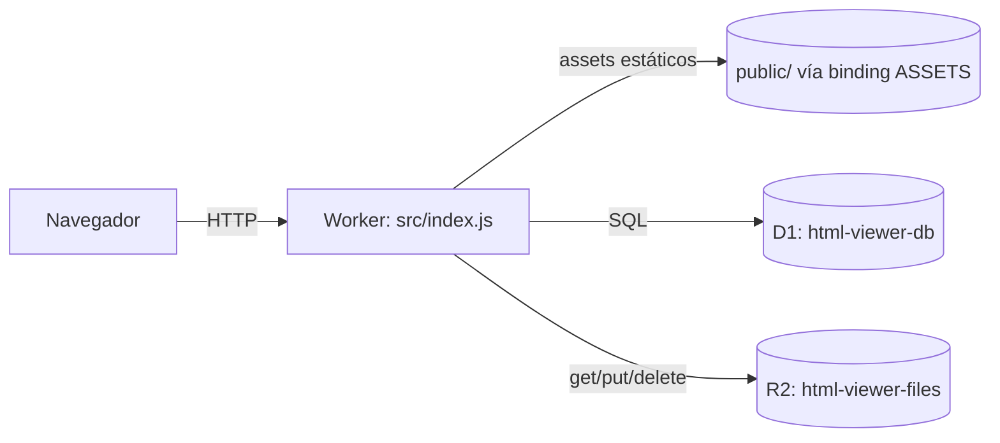

# DOCS.md — Mapeo técnico de html-viewer

Documentación de referencia del codebase: arquitectura, ruteo, backend función por función, modelo de datos, seguridad y una sección detallada de **cómo está construido el UI**. Refleja el estado actual del repo.

> Para instalación y despliegue, ver [README.md](README.md). Este documento es el "mapa absoluto" del código.

---

## 1. Visión general

`html-viewer` es una app de una sola pieza (un Worker de Cloudflare) que permite, con un **token único** de acceso:

1. Elegir/crear un **perfil** (nombre, correo, área) al iniciar sesión.
2. Subir archivos `.html` a una **biblioteca**, marcándolos **públicos o privados**.
3. Verlos renderizados, **editarlos** (texto, formato, bloques, tablas e imágenes, con deshacer/rehacer completo) o editar su **código** (con resaltado), y **presentarlos** a pantalla completa.
4. Generar un **link por archivo** para compartir: público (abierto a cualquiera) o privado (exige sesión).

El valor: cualquiera puede ver un reporte HTML por un link, sin saber qué es un HTML ni cómo abrirlo.

---

## 2. Arquitectura

Un único Worker sirve **todo**: el frontend estático (`public/`), la API JSON y el contenido HTML aislado. Los datos viven en **D1** (metadatos) y **R2** (contenido).


```mermaid
flowchart LR
  B[Navegador] -->|HTTP| W[Worker: src/index.js]
  W -->|assets estáticos| A[(public/ vía binding ASSETS)]
  W -->|SQL| D[(D1: html-viewer-db)]
  W -->|get/put/delete| R[(R2: html-viewer-files)]
```

**Principio de diseño:** el frontend es estático (HTML/CSS/JS vanilla, sin build). Las páginas no se renderizan en el servidor; cargan datos vía `fetch` a la API. El Worker solo corre lógica en rutas dinámicas (ver §7).

---

## 3. Stack tecnológico

| Capa | Tecnología | Por qué |
|---|---|---|
| Cómputo | Cloudflare Workers | Serverless, $0 inicial, sirve assets + API en un solo deploy |
| Metadatos | D1 (SQLite) | Relacional, incluido en Workers, ideal para perfiles/documentos |
| Contenido | R2 (object storage) | HTML puede pesar MB; D1 tiene límite de 1 MB/fila. R2 sin costo de egress |
| Frontend | HTML + CSS + JS vanilla (módulos ES) | Sin framework ni build step |
| CLI/deploy | Wrangler 4.x | `wrangler dev` (local con D1/R2 emulados) y `wrangler deploy` |

Sin paso de compilación: Wrangler empaqueta `src/index.js` directamente. El frontend no usa CDNs: **Inter**, **JetBrains Mono** y **CodeMirror 5** se sirven self-host desde `public/fonts/` y `public/vendor/`. La interfaz sigue el sistema de diseño **"Joaquin"** (ver §11).

---

## 4. Mapa de archivos

```
wrangler.jsonc            Config del Worker: assets, D1, R2, run_worker_first
package.json              Scripts (dev, deploy, db:migrate:*) y devDep wrangler
.dev.vars(.example)       Secretos locales: AUTH_TOKEN, SESSION_SECRET (.dev.vars git-ignored)
migrations/
  0001_init.sql           Esquema base: profiles, documents + índices
  0002_profiles_public.sql  profiles +email/area; documents +public; índices
  0003_comments.sql         Tabla comments (comentarios por documento)
  0004_comments_resolved.sql  comments +resolved/resolved_by/resolved_at
src/
  index.js                Router: API + contenido + sirve assets + failsafe de storage
  auth.js                 Sesión por cookie firmada (HMAC) + verificación de token
  util.js                 Helpers: respuestas JSON, ids, base64url
public/
  index.html / login.js     Login en 2 pasos (token → perfil)
  library.html / library.js Biblioteca: tabs Mis archivos/Públicos + galería de tarjetas
  viewer.html / viewer.js   Visor: Vista / Editar / Código, guardado, panel (comentarios + detalles)
  editor.js                 Editor enriquecido del modo Editar (formato, bloques, historial)
  comments.js               Comentarios del panel (resolver/reabrir/eliminar)
  shell.js                  Shell: ribbon + explorador + panel, subida, buscador ⌘K, cajones
  shared.html / shared.js   Vista pública compartida (+ Presentar; estados privado/no encontrado)
  app.css                   Sistema de diseño (tokens oscuro/claro, componentes ui-*) + layouts
  common.js                 Helpers, perfil/preferencias, modal/confirmación/menú/popover/toast,
                            compartir y modo presentación
  icons.js                  Íconos Lucide inline (icon(), hydrateIcons())
  theme.js                  Tema Sistema/Claro/Oscuro (menú del ribbon y botón #theme-mount)
  favicon.svg               Favicon (acento + </>; el sistema no define logo)
  fonts/                    Inter y JetBrains Mono variables, self-host (subset latin)
  vendor/codemirror/        CodeMirror 5 self-host (core + modos)
```

---

## 5. Modelo de datos (D1)

### Tabla `profiles`
| Columna | Tipo | Notas |
|---|---|---|
| `id` | INTEGER PK AUTOINCREMENT | |
| `name` | TEXT NOT NULL | Nombre del perfil |
| `email` | TEXT | Correo (opcional) — migración 0002 |
| `area` | TEXT | Área (opcional) — migración 0002 |
| `created_at` | TEXT | Default `datetime('now')` |

### Tabla `documents`
| Columna | Tipo | Notas |
|---|---|---|
| `id` | TEXT PK | UUID |
| `share_id` | TEXT UNIQUE NOT NULL | Token URL-safe para el link |
| `title` | TEXT NOT NULL | |
| `profile_id` | INTEGER | FK → `profiles(id)` `ON DELETE SET NULL` (enforce en código) |
| `r2_key` | TEXT NOT NULL | Key del contenido en R2 (`docs/<id>.html`) |
| `size` | INTEGER | Bytes del HTML |
| `public` | INTEGER NOT NULL DEFAULT 0 | 0=privado, 1=público — migración 0002 |
| `created_at` / `updated_at` | TEXT | Default `datetime('now')` |

**Índices:** `idx_documents_created`, `idx_documents_share`, `idx_documents_public`, `idx_documents_profile`.
**Regla:** el contenido HTML nunca va en D1 (límite 1 MB/fila); siempre en R2.

### Tabla `comments`
| Columna | Tipo | Notas |
|---|---|---|
| `id` | INTEGER PK AUTOINCREMENT | |
| `document_id` | TEXT NOT NULL | FK → `documents(id)` `ON DELETE CASCADE` (borrado en código) |
| `author` | TEXT | Nombre del perfil que comentó (snapshot) |
| `body` | TEXT NOT NULL | |
| `created_at` | TEXT | Default `datetime('now')` |
| `resolved` | INTEGER NOT NULL DEFAULT 0 | 0=abierto, 1=resuelto — migración 0004 |
| `resolved_by` | TEXT | Nombre del perfil que lo resolvió (snapshot); `NULL` si está abierto — 0004 |
| `resolved_at` | TEXT | Fecha de resolución; `NULL` si está abierto — 0004 |

Índice: `idx_comments_doc (document_id, created_at)` — migración 0003.

---

## 6. Almacenamiento (R2) y failsafe

- Bucket `html-viewer-files`, binding `BUCKET`. Una key por documento: `docs/<uuid>.html`.
- El contenido se guarda **tal cual** (sin sanitizar); el aislamiento ocurre al servirlo (§10).
- **Failsafe:** `STORAGE_LIMIT = 7 GiB`. El uso total se calcula con `SUM(size)` en D1. Si una subida o un crecimiento superaría el umbral, se responde **507** y la biblioteca muestra un banner; **eliminar siempre se permite** (para liberar espacio). Evita exceder el plan gratuito de R2 (10 GB).

---

## 7. Ruteo

`assets.run_worker_first = ["/api/*", "/auth/*", "/raw/*", "/doc/*", "/s/*"]`. El resto sirve assets directo.

| # | Patrón | Auth | Acción |
|---|---|---|---|
| 1 | `/raw/:shareId` | público si el doc es público; si no, **requiere sesión** | contenido HTML aislado (R2); `?download` fuerza descarga |
| 2 | `/api/shared/:shareId` | público (privado → 403 sin sesión) | metadatos `{title, updated_at, public}` |
| 3 | `/s/:shareId` | público | sirve `shared.html` |
| 4 | `POST /auth/login` | público | valida token → cookie |
| 5 | `POST /auth/logout` | público | borra cookie (204) |
| 6 | `/api/session` | — | 200 si hay sesión, 401 si no |
| 7 | `/doc/:id` | shell público | sirve `viewer.html` (datos requieren sesión) |
| 8 | `/api/*` | **requiere sesión** | `handleApi` (storage, perfiles, documentos) |
| 9 | (otra) | — | `env.ASSETS.fetch` |

Las páginas con segmento dinámico (`/doc/:id`, `/s/:shareId`) las sirve el Worker reusando el shell estático (`serveAsset`).

---

## 8. Backend (`src/`) — función por función

### `src/util.js`
`json`, `notFound`/`badRequest`/`unauthorized`, `newId` (uuid), `newShareId` (12 bytes → base64url), `base64url`.

### `src/auth.js`
Sesión **sin estado**: cookie `hv_session` firmada con HMAC-SHA256 (no se guarda en DB). `createSessionCookie` (payload `v1.<exp>` + firma; `HttpOnly; SameSite=Lax; Max-Age=30d`; `Secure` solo si HTTPS), `clearSessionCookie`, `isAuthed` (recomputa firma + valida expiración, tiempo constante), `verifyToken`.

### `src/index.js`
Constantes: `MAX_UPLOAD = 10 MB`, `STORAGE_LIMIT = 7 GiB`, `SANDBOX_CSP`.

- `fetch` → router (orden de §7), try/catch → 500.
- `serveAsset` → sirve un shell estático vía `env.ASSETS`.
- `handleLogin` → valida token → cookie.
- `handleRaw(request, env, url)` → busca por `share_id`; **si el doc es privado y no hay sesión → 403**; si no, devuelve el HTML con `Content-Security-Policy: sandbox …`, `nosniff`, `no-store` (y `Content-Disposition` con `?download`).
- `handleSharedMeta(request, env, path)` → `{title, updated_at, share_id, public}`; privado sin sesión → 403 `{private:true}`.
- `getUsedBytes` / `handleStorage` → `GET /api/storage` devuelve `{used, limit, percent, near, over}`.
- `storageBlocked(used)` → respuesta 507 con mensaje.
- `handleApi` → enruta:
  - `/api/storage` (GET).
  - `/api/profiles`: GET (`id,name,email,area`), POST (`{name,email,area}`); `DELETE /api/profiles/:id` (batch: null en docs + borrar perfil).
  - `/api/documents`: GET con filtros `?scope=public` (públicos) o `?profile_id=N` (de un perfil); POST → `uploadDocument`.
  - `/api/documents/:id`: GET (con `content`), PUT, DELETE.
  - `/api/documents/:id/comments`: GET (lista, incluye `resolved`, `resolved_by`, `resolved_at`) / POST (`{author, body}`).
  - `/api/comments/:id`: `DELETE` (204; 404 si no existe) y `PATCH {resolved, by}` → resolver (`resolved=1`, `resolved_by=by`, `resolved_at=now`) o reabrir (`resolved=0`, limpia ambos); 400 si falta `resolved`, 404 si no existe.
- `uploadDocument` → `multipart/form-data` (`file`, `title?`, `profile_id?`, `public`), valida ≤10 MB y el failsafe de storage, guarda en R2 e inserta.
- `getDocument` → fila (`SELECT d.*`, incluye `public`) + `profile_name` + `content` de R2.
- `updateDocument` → update parcial: `content` (reescribe R2 + chequeo de crecimiento vs failsafe), `title`, `profile_id`, `public`; siempre `updated_at`.
- `deleteDocument` → borra R2 + comentarios del doc + fila (batch).

Todas las consultas usan **prepared statements con `bind`** (sin inyección SQL).

---

## 9. Autenticación, sesión y perfil

- Un solo `AUTH_TOKEN` (secreto) → cookie firmada de 30 días. El token gatea toda la API.
- El **perfil activo** NO es seguridad: es una preferencia por navegador (`localStorage` `hv-profile`). Se elige al iniciar sesión y filtra la vista "Mis archivos". Como hay un único token, todo el contenido es accesible para esa sesión; el perfil es atribución/vista.
- En el cliente, `common.js → api()` redirige a `/` ante un 401 (excepto en `/` y `/s/...`). Las páginas del shell redirigen al login si no hay perfil activo.

---

## 10. Modelo de seguridad (aislamiento del HTML)

El HTML subido es contenido potencialmente activo. **No se sanitiza**; se **aísla al renderizar**. Contextos:

| Contexto | `sandbox` | Origen | Scripts |
|---|---|---|---|
| Vista pública (`/raw`), Vista del visor, thumbnails, modo presentación | `allow-scripts` (sin `allow-same-origin`) + `/raw` manda `CSP: sandbox` | Opaco | Corren, aislados |
| Editar (`#editFrame`) | `allow-same-origin` (**sin** `allow-scripts`) | Mismo origen | **Inertes** pero presentes en el DOM (se conservan al guardar) |

**Visibilidad:** un doc **privado** solo se sirve por `/raw` y `/api/shared` con sesión válida (403 si no). Un doc **público** es abierto a cualquiera con el link.

> Endurecimiento futuro: servir `/raw` desde un subdominio aparte para aislar también las cookies.

---

## 11. Cómo está construido el UI

### 11.1 Filosofía
- **Estático + JS vanilla con módulos ES**, sin framework ni bundler. La única librería de terceros es **CodeMirror 5** (vendored, carga diferida solo en el modo Código).
- **Sistema de diseño "Joaquin"** (DESIGN.md provisto por el usuario): lo que se presiona tiene **relieve** (gradiente + bisel), donde se escribe está **hundido** (pozo), la estructura es plana; superficies casi negras con hairlines, **un solo acento** naranja (`#e8490c`) y **brillo solo para lo activo** (seleccionado, encendido, con foco). Tema **oscuro por defecto** y un tema claro completo con los mismos tokens.
- Íconos **Lucide** inline (trazo 1.5, `currentColor`) desde `icons.js`. Sin logo: el nombre **"Visor HTML"** en Inter 600.
- **Voz**: oraciones con mayúscula inicial, botones con verbo (+ sustantivo), confirmaciones como pregunta con el verbo repetido en el botón ("¿Eliminar este documento?" → *Eliminar documento* / *Conservar documento*), errores que dicen cómo corregir, sin emoji ni signos de exclamación.

### 11.2 Tokens y componentes (`app.css`)
Orden del archivo: fuentes → tokens (`:root` = oscuro; `:root[data-theme="light"]` = claro) → base → componentes `ui-*` → shell → páginas → responsive.
- **Tokens**: superficies (`--bg-well`, `--bg`, `--surface`, `--surface-raised`, `--surface-overlay`, `--scrim`), tinta (`--ink-strong`, `--ink`, `--ink-muted`, `--ink-subtle`), líneas (`--line`, `--line-strong`, `--line-control`), controles (`--control-top/bottom/edge`, `--knob-*`), acento (`--accent` para marcas, `--accent-text` para texto, `--accent-top/bottom/edge` para rellenos, `--accent-soft/tint`), estados y categorías (success/danger/warning/info/teal/violet/amber, cada uno en trío sólido/texto/tinte), sombras (`--bevel-raised/accent/pressed/knob`, `--well`, `--elev-card/float/modal`, `--glow-*`, `--focus-ring`, `--focus-halo`, `--halo-danger`), radios (4/6/8/12/16), espaciado en base 4 px y movimiento (`--duration-*`, `--ease-*`; se anula con `prefers-reduced-motion`).
- **Tipografía**: **Inter** variable (con `cv01` y `ss03`) para todo y **JetBrains Mono** para código, fechas, tamaños y atajos. Ambas self-host en `public/fonts/` (subset latin).
- **Componentes**: `ui-btn` (`-primary` único por vista, `-ghost`, `-danger`, `-sm`, `-lg`, `-icon`, `-block`; presionado = gradiente invertido + bisel hundido + 1 px abajo), `ui-input`/`ui-field`/`ui-label`/`ui-help` (foco: borde de acento + halo; error: `aria-invalid` + texto), `ui-select`, `ui-switch`, `ui-segmented`/`ui-segment` (el activo sale en relieve con punto de acento), `ui-card` (+ `-interactive`), `ui-badge` (variantes por tono, `-dot`, `-count`), `ui-tabs`/`ui-tab`, `ui-progress`, `ui-scrim`/`ui-modal` (pie hundido con las acciones, la que confirma al final). Lo que el sistema no define (menús, popovers, toasts, callouts, estados vacíos) usa la opción más sobria: superficie elevada + hairline, sin brillo.
- `[hidden] { display: none !important }` global: ningún `display:flex` vuelve a mostrar algo oculto.

### 11.3 Shell (navegación tipo Obsidian)
`shell.js` arma, en biblioteca y visor, una grilla de 4 columnas:
1. **Ribbon** (48 px): mostrar/ocultar el explorador (`⌘\`), Biblioteca, Subir HTML y Buscar (`⌘K`); abajo, tema y avatar (menú de perfil: cambiar, crear, cerrar sesión). La página actual lleva una barra de acento con brillo.
2. **Explorador** (264 px, colapsable; preferencia `hv-left`): nombre de la app, filtro por título, dos carpetas colapsables —*Mis archivos* y *Públicos*— con el documento abierto resaltado, y medidor de almacenamiento (barra + badge de aviso cerca/al límite).
3. **Área de trabajo**: `view-header` (48 px) + contenido. El header compacta etiquetas según **su propio ancho** con *container queries* (`cq-hide-lg/md/sm`, `cq-square-md`), no según el viewport.
4. **Panel** (320 px, solo visor; preferencia `hv-right`, cerrado por defecto bajo 1440 px de ancho).
- **Subir HTML**: modal con zona de arrastre, título y switch *Documento público*; se abre desde el ribbon, el explorador, el header de la biblioteca o **soltando un .html en cualquier parte** (overlay de arrastre). Al terminar abre el documento nuevo.
- **Buscador rápido** (`⌘K`): documentos (míos + públicos, búsqueda por palabras sin acentos) y acciones; ↑/↓ + Enter.
- Datos compartidos: `loadDocs(scope)` cachea las listas que usan explorador y biblioteca; los eventos `hv:docs-changed` / `hv:doc-changed` invalidan y refrescan.
- **≤ 860 px**: ribbon + explorador y panel pasan a ser **cajones** con scrim (botón ☰ en el header). **≤ 560 px**: el header del visor se divide en dos filas (acciones arriba, selector de modo a ancho completo abajo).

### 11.4 Módulos del frontend
- `common.js`: `api`, `errorMessage`, formatos (`fmtDate`, `fmtShortDate`, `fmtSize`), `escapeHtml`, `initials`, atajos (`isMac`, `MOD`, `kbd`, `shortcut`), perfil activo y preferencias (`pref`/`setPref`), **toasts** con acción opcional (p. ej. *Deshacer*), `openModal` (foco atrapado, Esc, clic fuera), `confirmDialog`, `promptDialog` (con validación), `openMenu`/`openPopover` (se ubican sin salirse del viewport, teclado ↑/↓/Esc, ítems deshabilitables), `createProfileModal`, `setVisibility`/`shareUrl`/`copyText`, `shareModal` y `presentMode`.
- `icons.js`: `icon(nombre, tamaño)` y `hydrateIcons()` (reemplaza `<i data-icon>` del HTML estático).
- `theme.js`: preferencia Sistema/Claro/Oscuro (`hv-theme`), `openThemeMenu`, `bindThemeButton`; monta un botón en `#theme-mount` (login y página compartida). Cada `<head>` tiene un script inline que fija `data-theme` (y `data-left`/`data-right` en el shell) antes del primer pintado.
- `shell.js`: shell, subida, buscador rápido, cajones y atajos globales. `editor.js`: §11.6. `comments.js`: comentarios del panel.

### 11.5 Páginas
- **Login** (`index.html` + `login.js`): tarjeta con indicador de 2 pasos —(1) token, (2) perfil (select + *Crear perfil nuevo*)—. Errores en línea con `aria-invalid` y texto que dice cómo corregir. Con sesión y perfil, salta a la biblioteca.
- **Biblioteca** (`library.html` + `library.js`): header con ruta y *Subir HTML* (primario); título de página, tabs *Mis archivos* / *Públicos* con conteos (`?scope=public` en la URL), callout de almacenamiento y **galería** de tarjetas interactivas: miniatura en vivo (iframe a `/raw` escalado, lazy con `IntersectionObserver`), badges *Público*/*Privado*, tamaño y fecha en mono, acciones compartir/descargar/eliminar (eliminar solo en documentos propios o sin perfil, con confirmación). Estados vacíos con el siguiente paso.
- **Visor** (`viewer.html` + `viewer.js`): header con ruta (*Mis archivos* o *Públicos*) + **título editable** (Enter confirma, Esc revierte) + **estado de guardado** (punto + *Cambios sin guardar / Guardando… / Guardado / No se guardó*); al centro el segmentado **Vista · Editar · Código**; a la derecha *Descartar* (solo con cambios), *Presentar*, *Compartir*, **Guardar** (`⌘S` en los tres modos) y el botón del panel (muestra el conteo de comentarios abiertos cuando está cerrado). El documento es una hoja delimitada (`max-width: 1300px`); en Editar se ilumina con borde y brillo de acento. **Panel**: pestañas *Comentarios* (lista, resolver/reabrir, eliminar con confirmación, `⌘↵` para enviar) y *Detalles* (propietario, fechas, tamaño; switch *Documento público*, link + copiar; *Descargar HTML* —incluye los cambios sin guardar— y *Eliminar documento*). `#editar` / `#codigo` en la URL abren directo ese modo.
  - **Estado de cambios real**: `isDirty()` compara el contenido vigente con el último guardado (y el título). Entrar y salir de Editar sin tocar nada no ensucia (se compara contra la serialización base del editor) y deshacer hasta el estado guardado vuelve a "limpio". *Guardar* envía solo lo que cambió (`content` y/o `title`); *Descartar* (con confirmación) recarga la última versión guardada.
- **Compartida** (`shared.html` + `shared.js`): header mínimo (nombre → `/`, título, tema, *Descargar*, *Presentar*) y la hoja con el iframe a `/raw`; tarjetas de estado para **privado** (403, con *Iniciar sesión*) y **no encontrado**.

### 11.6 Edición (`editor.js`)
Sigue siendo `designMode` sobre el DOM real (sin librerías RTE que reinterpreten el documento). La UI vive en el padre; el único nodo que se inyecta en el documento es un `<style data-hv-editor>` (color de selección, marcador de gráficos y revelado de ocultos) que `serialize()` quita antes de leer `outerHTML` y repone después.
- **Historial propio** basado en instantáneas (`body.innerHTML` + selección + bloque activo): cubre por igual la escritura (agrupada en ráfagas: pausa > 1 s o cambio entre escribir y borrar), el formato y las operaciones de bloque; tope de 200 pasos / ~40 M caracteres. `⌘Z`, `⌘⇧Z`, `⌘Y` y el menú Edición del sistema (`beforeinput` historyUndo/historyRedo) usan este historial; *Deshacer*/*Rehacer* se deshabilitan cuando no hay pasos. Toda mutación pasa por `mutate()`, que solo registra un paso si el HTML cambió.
- **Barra de formato** (anclada arriba; pasa a una segunda fila si no cabe): deshacer/rehacer · estilo de párrafo (Párrafo, Título 1–4, Cita, Código) · negrita, cursiva, subrayado, tachado (con estado presionado) · color de texto y resaltado (paleta + personalizado + *Color automático*/*Sin resaltado*) · listas y sangría −/+ (solo dentro de listas) · alineación (menú que muestra la actual) · enlace (modal con validación; edita el existente o, sin texto seleccionado, inserta la URL como texto) y quitar enlace (solo si hay uno) · insertar imagen · quitar formato · **Ocultos** (revela los bloques ocultos, con conteo) · atajos de teclado.
- **Editor de bloques** (modelo "bloque activo"): un clic define el bloque (párrafos, títulos, listas, tablas, secciones, divs…; las celdas resuelven a su **fila**; imágenes, gráficos y videos se seleccionan como bloque). Contorno con borde, lavado y brillo de acento + mini-barra encima (debajo si no cabe). Las acciones vienen en **pares**: seleccionar contenedor ↔ interior (la **ruta** de la barra de estado conserva el nivel interior para volver y también se navega con clic), mover arriba ↔ abajo (`⌘⇧↑/↓`), duplicar (la copia queda seleccionada) e insertar debajo (párrafo, ítem o fila según el bloque), A− ↔ A+ (texto; en imágenes, tamaño), fondo (paleta + *Sin fondo*), restablecer (quita tamaño, fondo y alineación aplicados), ocultar ↔ mostrar, eliminar (toast con *Deshacer*). En filas de tabla aparece **Columna**: insertar a la izquierda/derecha, mover a la izquierda/derecha (deshabilitado en los bordes) y eliminar, simétrico a las operaciones de fila.
- **Imágenes**: desde archivo (arrastrar o elegir; se reduce a 1600 px de ancho y se embebe como data URL, máx. ~2,5 MB) o desde una URL `http(s)`, con texto alternativo.
- **Gráficos**: sin scripts, un `<canvas>` se dibuja como su contenido alternativo (0×0). El editor le da una caja rayada del tamaño declarado (`attr(width px)` donde el navegador lo soporta; si no, 100 % × 180 px) y la barra de estado explica que se ven en Vista.
- **Barra de estado**: ruta del bloque con nombres legibles ("Sección .kpis-wrap › Bloque .card › Párrafo") y una pista contextual.
- Atajos dentro del documento: `⌘S`, `⌘Z`, `⌘⇧Z`, `⌘B/I/U`, `⌘K` (enlace), `⌘⇧↑/↓`, `Esc` (deseleccionar) y `⌫` sobre una imagen seleccionada.

### 11.7 Modo presentación (`presentMode`)
Overlay a pantalla completa (usa la **Fullscreen API**; si falla, queda como overlay fijo) con barra de controles: **zoom −/+**, indicador % (mono), **Ajustar** y **Salir**. Atajos: `+`/`-` zoom, `0` ajustar, `Esc` salir. El zoom es real (`transform: scale`) con un wrap dimensionado para permitir scroll al acercar. Se invoca desde el visor (con `srcdoc` del contenido actual) y desde la página compartida (con `src=/raw/:shareId`).

### 11.8 Patrón datos → DOM
Listas con template strings + `escapeHtml` vía `innerHTML`; handlers por **delegación** (`data-act` para el shell, `data-card` en la galería, `data-ed` en el editor, `data-cact` en comentarios). Tras una mutación se vuelve a llamar la función de carga.

### 11.9 Preferencias de UI (`localStorage`)
`hv-profile` (perfil activo), `hv-theme`, `hv-left` / `hv-right` (explorador / panel, leídas por el script inline del `<head>` para evitar saltos), `hv-panel-tab`, `hv-lib-scope` y `hv-tree-mine` / `hv-tree-public` (carpetas colapsadas).

---

## 12. Referencia de API

| Método | Ruta | Auth | Descripción |
|---|---|---|---|
| POST | `/auth/login` | — | `{token}` → cookie |
| POST | `/auth/logout` | — | Cierra sesión |
| GET | `/api/session` | cookie | Verifica sesión |
| GET | `/api/storage` | sí | `{used, limit, percent, near, over}` |
| GET / POST | `/api/profiles` | sí | Lista (`id,name,email,area`) / crea (`{name,email,area}`) |
| DELETE | `/api/profiles/:id` | sí | Elimina perfil |
| GET | `/api/documents?scope=public` | sí | Documentos públicos |
| GET | `/api/documents?profile_id=N` | sí | Documentos de un perfil |
| POST | `/api/documents` | sí | multipart `file,title?,profile_id?,public` |
| GET / PUT / DELETE | `/api/documents/:id` | sí | Lee (con `content`) / actualiza (`content?,title?,profile_id?,public?`) / elimina |
| GET / POST | `/api/documents/:id/comments` | sí | Lista (con estado `resolved`) / agrega comentario (`{author, body}`) |
| PATCH | `/api/comments/:id` | sí | Resuelve / reabre (`{resolved: true\|false, by}`) |
| DELETE | `/api/comments/:id` | sí | Elimina un comentario (404 si no existe) |
| GET | `/api/shared/:shareId` | — (privado: 403) | Metadatos públicos |
| GET | `/raw/:shareId` | público o sesión si privado | Contenido aislado (`?download`) |
| GET | `/s/:shareId` · `/doc/:id` | — / shell | Páginas (datos según auth) |

---

## 13. Configuración
- `wrangler.jsonc`: `assets` (directory `./public`, `run_worker_first`), `d1_databases` (binding `DB`, `database_id`), `r2_buckets` (binding `BUCKET`), `observability`.
- Secretos: `AUTH_TOKEN`, `SESSION_SECRET`. Local en `.dev.vars`; producción con `wrangler secret put`.

## 14. Desarrollo y despliegue
```bash
npm install
cp .dev.vars.example .dev.vars      # define AUTH_TOKEN y SESSION_SECRET
npm run db:migrate:local
npm run dev                         # http://localhost:8787
```
Despliegue: `wrangler d1 create`, `wrangler r2 bucket create`, `npm run db:migrate:remote`, `wrangler secret put …`, `npm run deploy`. Detalle en [README.md](README.md).

## 15. Limitaciones conocidas
- Sin versionado/historial de ediciones entre sesiones (el guardado sobrescribe; el deshacer vive mientras el documento está abierto en Editar).
- Sin carpetas ni etiquetas; la búsqueda es por título (filtro del explorador y `⌘K`).
- `/raw` se sirve desde el mismo origin (idealmente, subdominio aparte).
- Perfil = atribución/vista por navegador, no cuenta (un solo token de acceso global).
- Las operaciones de columna asumen tablas sin celdas combinadas (`colspan`/`rowspan`); los datos de un gráfico solo se editan desde Código; no hay edición asistida por IA.
- La caja de los gráficos en Editar usa `attr()` tipado (Chrome 133+); en otros navegadores mide 100 % × 180 px.
- Thumbnails = iframes en vivo escalados (no pre-renderizados); con bibliotecas muy grandes conviene pre-render server-side.
